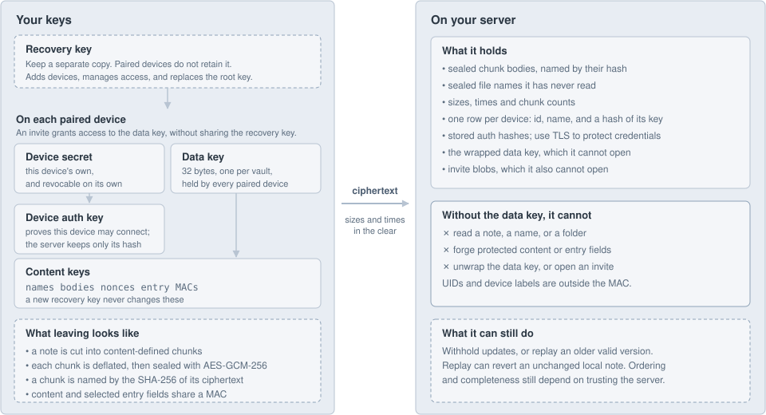
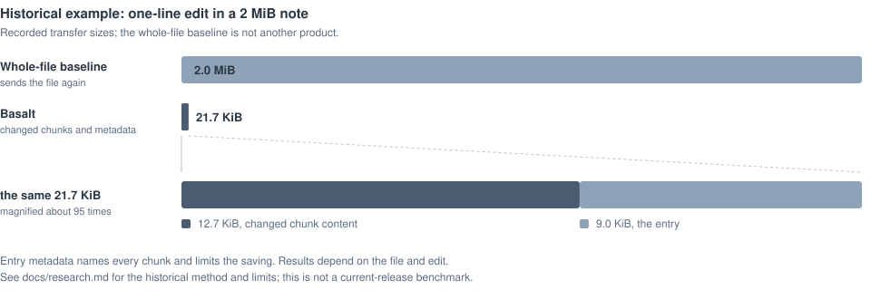

#  Basalt Sync

**Fast, private, self-hosted sync for Obsidian.**

One binary and one pairing string. Only the part of a note that changed crosses the wire, and it is encrypted before it leaves your device.

[](https://github.com/waynehoover/basalt-sync/actions/workflows/ci.yml)
[](LICENSE)
[](server/go.mod)
[](https://www.npmjs.com/package/basalt-sync)

<a href="#get-started">Get started</a> | <a href="docs/server.md">Server</a> | <a href="docs/plugin.md">Plugin</a> | <a href="docs/protocol.md">Protocol</a> | <a href="docs/compared.md">How it compares</a>

<table>
  <tr>
    <th align="center">The panel, which is all of the interface</th>
    <th align="center">Version history, with a diff against disk</th>
  </tr>
  <tr>
    <td align="center">
      <picture>
        <source media="(prefers-color-scheme: dark)" srcset="docs/assets/screenshots/panel-dark.png">
        
      </picture>
    </td>
    <td align="center">
      <picture>
        <source media="(prefers-color-scheme: dark)" srcset="docs/assets/screenshots/changes-dark.png">
        
      </picture>
    </td>
  </tr>
</table>

## Why

I wanted self-hosted sync that is as easy as the official one, without the setup every other sync plugin asks for. So: one server, one panel, and no settings to get wrong.

## Get started

**1. Run the server.**

```bash
docker run -d --name basalt -p 127.0.0.1:3003:3003 -v basalt-data:/data ghcr.io/waynehoover/basalt-sync
docker logs basalt
```

The log prints one line for your first device: `host:3003#TOKEN`. There is no TLS in the binary on purpose, so put something in front before anything else reaches it. `tailscale serve --bg 3003` does it; [docs/server.md](docs/server.md) has Compose, systemd and Caddy.

**2. Install the plugin.** Not in the community directory yet, so drop `main.js`, `manifest.json` and `styles.css` from the [latest release](https://github.com/waynehoover/basalt-sync/releases/latest) into `<vault>/.obsidian/plugins/basalt-sync/`, then enable Basalt Sync under Community plugins.

**3. Start the vault.** Open Basalt from the ribbon icon or Settings, paste that line under **Start a new vault**, and write down the recovery key it shows once. It is the only way back if every device is lost, and anyone holding it has the vault.

**4. Add your other devices.** On a device that already has the vault, press **Add another device**, then **Create invite**, and paste what it shows into Basalt on the new one. An invite works once and expires in ten minutes.

### Without Obsidian

The same engine with the filesystem in place of Obsidian's API, for a NAS or a server.

```bash
npm install -g basalt-sync
basalt init 'homelab:3003#K7M2...'   # the first device, from the server log
basalt invite                        # on a device that has the vault
basalt pair basalt3i_...             # on the new device
basalt sync --watch
```

## What you get

- End-to-end encrypted note contents and file names
- Only the chunk that changed crosses the wire
- Conflicts keep both versions, and never rewrite the file you have open
- Full version history and deleted-note recovery, inside Obsidian
- A credential per device, so a lost one is revoked without touching the others
- A headless client for a machine with no Obsidian (experimental)

**Where it is supported.** Obsidian on macOS and Linux desktops and on Android, over a local filesystem, one Basalt writer per vault. Not iOS, which should work and has never been run. Not a vault another sync tool also has (Dropbox, iCloud Drive, Syncthing, LiveSync): keeping your edits works by moving bytes aside and identifying them afterwards, and a second engine moving the same bytes turns every step of that into a guess. Not a network filesystem. [docs/design.md](docs/design.md#where-this-is-supported) has the whole list and the reasons.

The headless client is experimental. It is a mirror for a machine with no Obsidian, not a general-purpose writable client.

Also not yet: a memory measurement on an older phone, the community directory, and syncing themes and snippets.

## Security

<picture>
  <source media="(prefers-color-scheme: dark)" srcset="docs/assets/security-dark.svg">
  
</picture>

- **The server never holds a key.** It sees ciphertext, its length, and which chunks repeat, which is what deduplication is made of.
- **It cannot write, either.** Every version is signed under a key the server has never seen, so it cannot forge one, alter one, or move a file's contents onto another.
- **Lose a device, revoke a device.** Each holds a credential of its own, never the recovery key. Leak that and `basalt rotate` replaces it without losing history or disconnecting anything.

A server can still go quiet, and it can hand back an old version of a note under a new number, which reverts it to something it really did say once. It cannot invent, alter or mix up a version. Two devices disagreeing is how you notice. Stated rather than solved: [the design doc](docs/design.md) has both, and what would close the second.

## Speed

<picture>
  <source media="(prefers-color-scheme: dark)" srcset="docs/assets/wire-dark.svg">
  
</picture>

- **Only the delta.** Notes are cut into content-defined chunks, so editing one line of a 2 MiB note sends 21.7 KiB.
- **Tens of round trips, not thousands.** Two thousand files reach a second device in 18 up and 27 down.
- **Measured, not claimed.** Including a run against a real 3,751-file vault: [docs/compared.md](docs/compared.md).

## Docs

| | |
|---|---|
| [Server](docs/server.md) | Install, TLS, backup, restore, every flag |
| [Plugin](docs/plugin.md) | Pairing, history, conflicts, phones |
| [Headless client](client/README.md) | The `basalt` command |
| [How it compares](docs/compared.md) | Against the alternatives, with measurements |
| [Design](docs/design.md) | Durability rules, threat model, what is refused |
| [Protocol](docs/protocol.md) | The wire protocol |
| [Index journal](docs/index-journal.md) | How the client stores its index, and what a crash does to it |
| [Findings](docs/findings.md) | Every numbered review finding a code comment cites |

## License

MIT. See [LICENSE](LICENSE).
