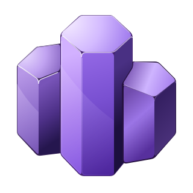
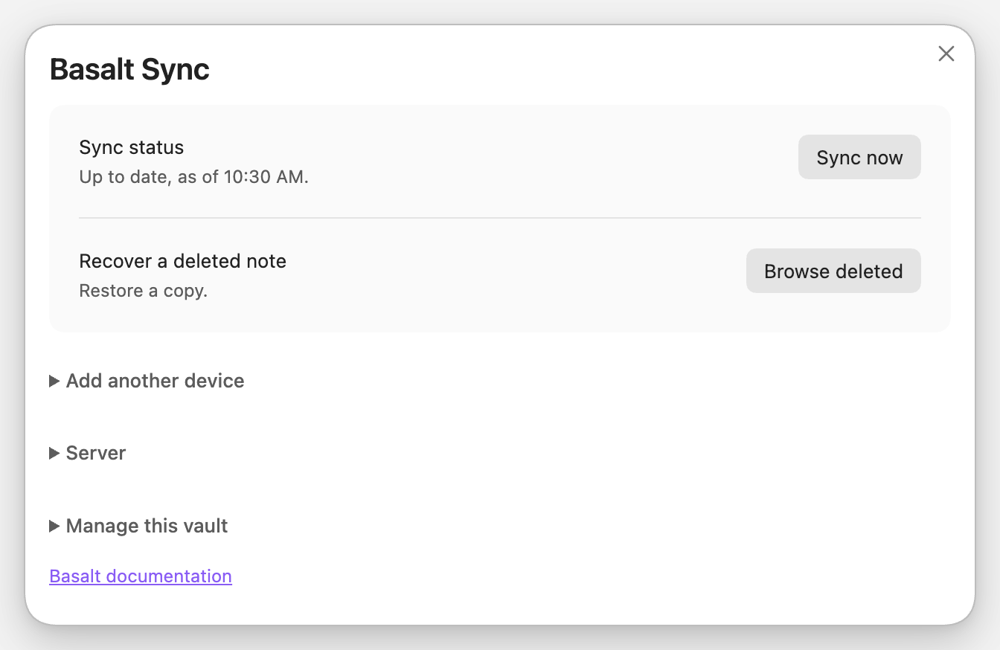

#  Basalt Sync

**Fast, secure, self-hosted sync for Obsidian. Simple setup.**

Basalt keeps your notes in sync through a server you control. Note contents and
filenames are encrypted on your devices. Keep writing offline, catch up when
you reconnect, and recover earlier versions from inside Obsidian.

**[Get started](docs/server.md)** · [How it compares](docs/compared.md) · [Documentation](docs/index.md)

<picture>
  <source media="(prefers-color-scheme: dark)" srcset="docs/assets/screenshots/panel-dark.png">
  
</picture>

## Made for your personal vault

- **Host it where you want.** Run a Docker container or a standalone server
  binary on your homelab. Basalt is free, open-source software; you provide the
  hosting and backups.
- **Encrypt before upload.** Contents and filenames are encrypted on your
  devices. The server stores the encrypted copies.
- **Send less when you edit.** Basalt uploads changed pieces of a file and
  reuses the rest, reducing transfers and storage across versions.
- **Recover your work.** Browse history, compare changes, and restore deleted
  notes. Restoring creates a separate copy when a file already exists.
- **Handle conflicting edits.** Basalt combines edits when its merge checks
  pass and keeps both versions when they do not. Review preserved copies
  together and choose what to keep.
- **Add devices with an invite.** Scan a QR code or copy a pairing code. There
  is no fixed device limit, and you can revoke a lost device from another one.

## Get started

**Run Basalt behind Tailscale Serve or an HTTPS reverse proxy.** Tailscale Serve
is the recommended option for a personal homelab: only your permitted Tailscale
devices can reach it. You can also use Caddy or an existing HTTPS proxy with your
own domain. Keep Basalt's port 3003 private.

1. **[Set up your server](docs/server.md).** Run Basalt, follow the
   [secure connection setup](docs/server.md#secure-access), and get the setup
   string for your first device.
2. **[Install the Obsidian plugin](docs/plugin.md#install).** Start the vault
   with that string and save the recovery key shown during setup.
3. **[Add your other devices](docs/plugin.md#pairing).** Create an invite, then
   scan its QR code or paste the pairing code into Basalt on the next device.

**Prefer to have your agent handle setup?** Give it [llm.md](llm.md). The guide
covers the server, plugin, pairing, and checks that sync works.

For a NAS or a machine without Obsidian, the experimental
**[command-line client](client/README.md)** can keep a local mirror.

## Before you choose Basalt

Basalt is an early project for one person's devices. The supported setup is
Obsidian on **macOS, Linux, and Android**, with local storage. The plugin needs
Obsidian **1.7.2 or newer** and is installed manually. iOS is untested; Windows
is not supported.

On Android, sync runs while Obsidian is open in the foreground. Settings,
themes, plugins, and hidden files do not sync. Attachments are included, with a
default limit of **64 MiB per file**.

Use one sync service per local vault, and keep it off network filesystems.
Basalt needs you to maintain the server and keep backups. See
**[How it compares](docs/compared.md)** if you prefer a hosted service or need
different storage options.

## Find what you need

| I want to… | Guide |
|---|---|
| Set up Basalt with an agent | [Agent installation guide](llm.md) |
| Run Basalt on my server | [Server setup](docs/server.md) |
| Pair devices or recover a note | [Obsidian plugin](docs/plugin.md) |
| Back up, restore, or free server space | [Server maintenance](docs/server-operations.md) |
| Keep a copy without Obsidian | [Command-line client](client/README.md) |
| Understand privacy and recovery keys | [Security and privacy](docs/security.md) |
| Build or contribute | [Developer documentation](docs/development.md) |

## License

[MIT](LICENSE).
