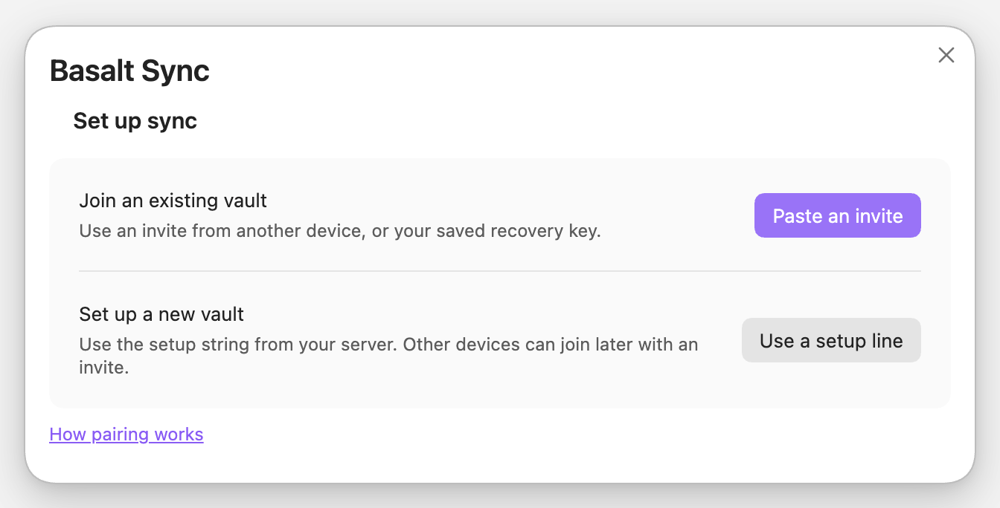
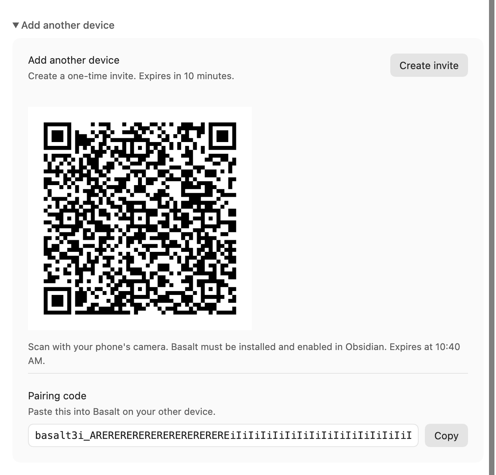
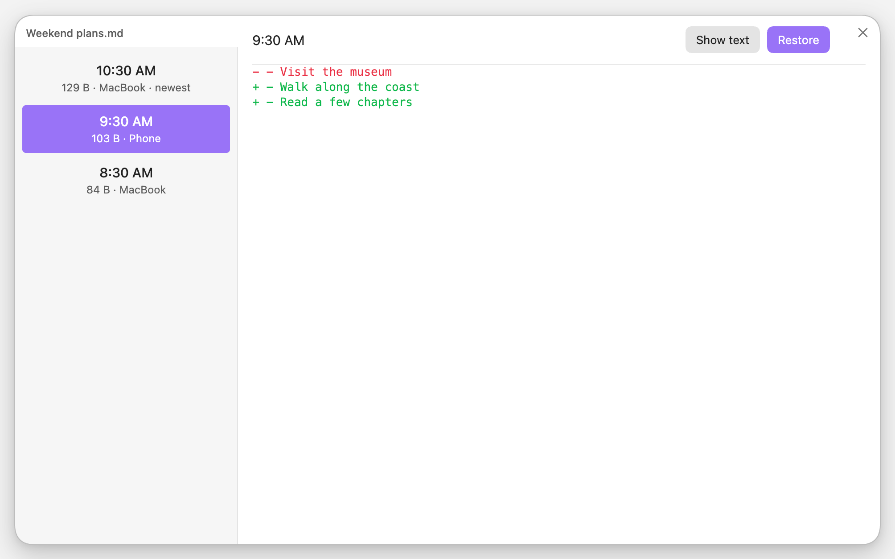
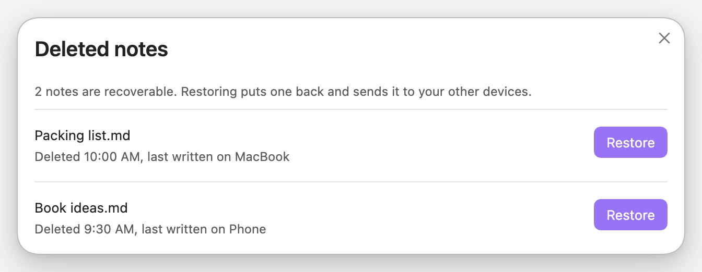
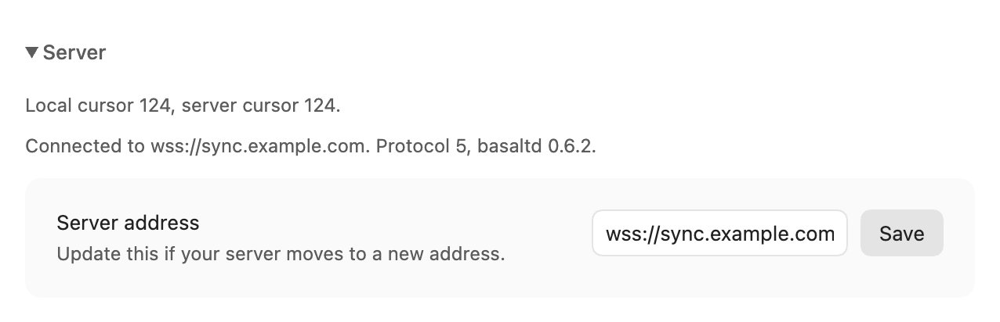
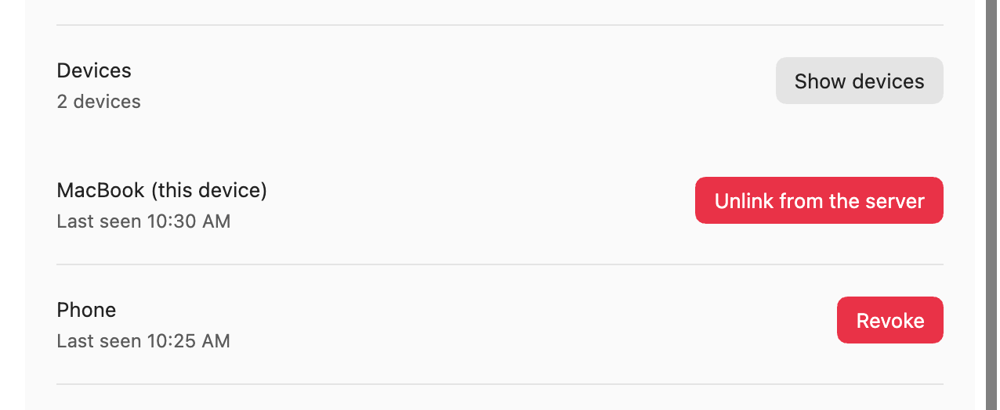

# Use Basalt in Obsidian

[Documentation](index.md) · [Server setup](server.md) · [Security and privacy](security.md)

Basalt syncs your notes and attachments, shows sync status, and lets you recover
earlier versions from inside Obsidian. Start with a
[configured server](server.md) and Obsidian **1.7.2 or newer**.

Use a local vault on macOS, Linux, or Android. iOS is untested; Windows is not
supported. Back up an existing vault before pairing, and disable other sync
services for that vault. Each device should have its own local copy.

## Install

1. Download `main.js`, `manifest.json`, and `styles.css` from the newest stable
   [plugin release](https://github.com/waynehoover/basalt-sync/releases).
   Plugin releases use a plain version such as `0.6.3`; skip `server/v…` and `cli/v…`.
2. Create `<vault>/.obsidian/plugins/basalt-sync/` and put the three files there.
   If you use a custom Obsidian configuration folder, use that folder instead
   of `.obsidian`.
3. Reload Obsidian and enable **Basalt Sync** under **Settings → Community plugins**.
4. Open the Basalt ribbon icon or run **Basalt Sync: Show status** from the
   command palette.

Manual installation is required while Basalt is outside the community directory.
To upgrade, replace the same three files and reload Obsidian. When a release
changes the protocol, upgrade the server before its clients.

## Pairing

<details>
<summary>See the setup screen</summary>

<picture>
  <source media="(prefers-color-scheme: dark)" srcset="assets/screenshots/pairing-dark.png">
  
</picture>

</details>

### Start your first device

1. Choose **Use a setup line** for the first device, then give it a recognizable
   name, such as `laptop`.
2. Paste the server's setup string into
   **Setup string**. With TLS configured, it looks like
   `wss://homelab.example.ts.net#TOKEN`.
3. Press **Start a new vault**, save the recovery key under **Write this down**,
   then press **I have written it down**.
4. Wait for sync to finish before adding another device.

Keep the recovery key somewhere safe and separate from your devices. It is how
you regain access if every device is lost; Basalt cannot reissue it. Use an
invite for routine pairing.

A server using a vault name other than `default` must be initialized once with
[the CLI](server.md#a-vault-that-is-not-called-default). The plugin can then
join it with an invite.

### Add another device

1. On a paired device, open **Add another device → Create invite**.
2. On your phone, install and enable Basalt, then scan the QR code. Or copy the
   pairing code and press **Paste an invite** under **Join an existing vault**
   on the new device.
3. Choose a device name and **First sync** option:
   - **Download server vault** (default): start with an empty vault to download
     your synced notes. Existing notes and attachments block pairing and stay untouched.
   - **Combine local files**: upload this device's existing files too. An older
     copy can bring back files moved or deleted elsewhere.
4. Press **Pair**. If you copied the invite, paste it into **Invite or recovery
   key** first.
5. Keep Obsidian open while the first sync finishes. After setup, changes sync
   both ways with either choice.

To download a fresh copy, create a new empty Obsidian vault and keep the old
vault as a backup. Basalt does not clear or move existing files during pairing.

An invite works once and expires after ten minutes. If it expires, create a new
one. If no paired device remains, paste the recovery key into the same field.
There is no fixed device limit. Older servers may still enforce their previous
limit; update the server to remove it.

<details>
<summary>See the QR code and pairing code</summary>

<picture>
  <source media="(prefers-color-scheme: dark)" srcset="assets/screenshots/invite-dark.png">
  
</picture>

</details>

## What it does

Basalt syncs shortly after edits and checks periodically while Obsidian is open.
It reconnects after a dropped connection. You can also press **Sync now**.

Open the panel for the result and any files needing attention. It includes the
server address and version, useful when diagnosing a connection problem.

| Status | What to do |
|---|---|
| Unpaired | Pair this vault. |
| Connecting, loading history, or syncing | Keep Obsidian open until sync finishes. |
| Synced | No outstanding work was reported. |
| Needs attention | Open the panel and follow the reason shown for each file. |
| Failed or offline | Check the connection and the reported error; Basalt retries temporary failures. |
| Stopped | Follow the panel's instructions. Repeated attempts alone will not fix this condition. |

For a protocol mismatch, update the server and plugin to compatible releases.
For a restored server, use **Rejoin this server** below. If the panel reports
unreadable local state, preserve that state and your notes before attempting
recovery; deleting the plugin's files is not a general troubleshooting step.

## Version history

Run **Basalt Sync: Show version history** for the open note, or use the note's
right-click menu. Choose a version to read it or compare it with the local copy.
Use **Show older** to go further back.

<picture>
  <source media="(prefers-color-scheme: dark)" srcset="assets/screenshots/changes-dark.png">
  
</picture>

**Restore does not overwrite an existing file.** If the original path is
occupied, the copy appears beside it, for example `Note (restored 42).md`.
Basalt reports whether it was also sent to your other devices or is waiting
for a successful sync.

History remains available until the server operator
[purges it](server-operations.md#purge).

## Deleted notes

Press **Browse deleted**, select the note, and restore it. A note whose
content has been purged is listed without a restore button.

<details>
<summary>See deleted notes</summary>

<picture>
  <source media="(prefers-color-scheme: dark)" srcset="assets/screenshots/deleted-dark.png">
  
</picture>

</details>

A deletion received from another device goes to the system trash, or the
vault's `.trash` if necessary. If you edit a note while another device deletes
it, Basalt keeps the edit and sends it back as a new version.

## Conflicts

Basalt tries to combine edits made on different devices. If its merge checks
fail, it keeps both versions, for example:

```text
Meeting notes.md
Meeting notes (Conflicted copy laptop 202608311412).md
```

Open both files, combine the parts you want, then delete the extra copy when
you are satisfied. Usually the incoming version gets the conflict name. An edit
that arrives during a file replacement can instead be preserved under a new
name; the panel reports preserved versions that need attention.

Successful merges and ordinary downloads can update the original note. Keeping
both versions on a conflict is not a promise that sync never changes an open file.

## What is not synced

- Obsidian's configuration folder: settings, plugins, themes, snippets, and
  workspace layout.
- Files or folders whose names start with a dot, at any depth, including
  `.git`, `.trash`, and `.basalt`.
- Files above the server's limit, **64 MiB by default**. The server operator
  can [adjust the limit](server-reference.md#serve).

Other notes and attachments are included. Large attachments need more memory,
particularly on phones.

## Phones

Android sync runs while Obsidian is **open in the foreground**. There is no
background service or push notification to wake it. Keep the screen on for a
large first sync, and let changes finish before closing the app.

iOS has not been tested. If a first connection is rejected because of its
browser origin, the panel shows an origin hint for the server operator; see
[server connection troubleshooting](server.md#connection-troubleshooting).

## Change the server address

Open **Server → Server address**, enter the new address, and press **Save**.
Basalt checks the connection using this device's existing pairing before saving.
Use this when the same server moves to a new hostname or port. Notes and sync
history are kept. Update the address on each device.

<details>
<summary>See server settings</summary>

<picture>
  <source media="(prefers-color-scheme: dark)" srcset="assets/screenshots/server-dark.png">
  
</picture>

</details>

## Devices, and revoking one

Under **Manage this vault**:

- **This device's name → Rename** changes the label used for future activity.
  Existing history and conflict filenames retain their old labels.
- **Devices → Show devices** lists registered devices and outstanding invites.
- **Revoke** stops a device connecting; **Cancel** invalidates an unused invite.

When names match, the list shows device IDs to help you tell them apart.
Rows marked **Never connected** may be left by an interrupted pairing.

<details>
<summary>See the device list</summary>

<picture>
  <source media="(prefers-color-scheme: dark)" srcset="assets/screenshots/devices-dark.png">
  
</picture>

</details>

Revocation cannot erase notes or decryption keys already on a device. See
[what to do after losing a device](security.md#if-a-device-is-lost-or-stolen).
Revoking the final device requires the recovery key and the
[CLI](cli-reference.md#device-access).

## Replacing the vault's secret

If your recovery key was exposed, choose **Manage this vault → Replace the
vault's secret**, provide the current recovery key, and follow the confirmation.
Save the new key. If the result is uncertain, keep both keys and follow the
message before discarding either.

This replaces the recovery key and cancels outstanding invites. Existing
devices keep syncing and history remains available. It does not revoke those
devices or replace the data-encryption key. Review
[the privacy limits](security.md#if-a-device-is-lost-or-stolen) before relying
on it after a theft.

## Rejoining a restored server

After the server is restored from an older backup, the panel may show
**Stopped** and offer **Rejoin this server**.

First have the operator back up the restored server and preserve local notes.
Press **Rejoin this server**, review the two positions shown, then confirm.
Basalt rejoins and sends versions held only on this device, keeping both copies
where they disagree. Prefer this action to unlinking and pairing again.

## Sending back what the server has lost

If the operator confirms that the server is missing stored content, choose
**Manage this vault → Send back what the server has lost** on a device that
still has the notes. Basalt resends missing content without creating new note
versions.

Repeat on other devices that may have additional copies. The operator should
then run `basaltd verify`; a successful repair on one device cannot establish
that all server history is recoverable.

## Durability

Basalt stages incoming files and checks the written bytes before putting them
in place. Desktop and mobile provide different guarantees during a power loss;
keep independent backups of your notes.

If the panel says **versions were kept somewhere Obsidian does not show**, keep
the named files and the plugin's state folder. The notice gives their retained
locations. Copy a retained version to a new visible note and check it before
removing any recovery material. Do not clear hidden files as a general cleanup.
The [technical design](design.md#file-replacement) explains these paths.

## Unlink

**Manage this vault → Unlink this vault** stops syncing here and removes the
local pairing and sync index. Your notes remain on this device and the server.
Pair again to resume. Unlinking locally does not revoke the server's device
record; use **Devices** when you want to remove access.

## Commands

| Command-palette action | Result |
|---|---|
| Basalt Sync: Sync now | Run a sync. |
| Basalt Sync: Show status | Open the panel. |
| Basalt Sync: Show version history | View history for the open note. |
| Basalt Sync: Recover a deleted note | Browse deleted notes. |
